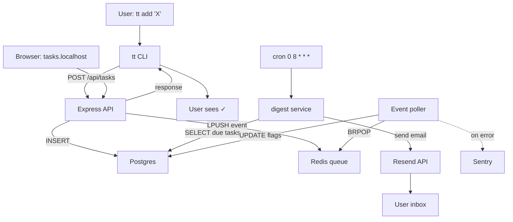

# PROCESS-MAP — TaskTracker

<!-- AUTO-START: vault-process-map -->
_Auto-section not populated yet. Run `vault refresh` to fill._
<!-- AUTO-END: vault-process-map -->

---

## ✏️ Manual — flow diagram

## 🔗 Cross-process dependencies
- **API** + **CLI** + **Web** all share same Postgres + Redis
- **Digest** is independent — runs once daily
- **Event poller** is independent — drains Redis queue continuously

## 📋 Schedule
- `0 8 * * *` — Daily digest (Resend send)
- `*/15 * * * *` — Redis queue health check (Sentry breadcrumb)
- `0 3 * * 0` — Weekly archive (move `archived: true` rows to `tasks_archive` table)

## 📂 Files
- `src/api/` — Express server
- `src/cli/` — `tt` binary source
- `src/web/` — Next.js pages
- `src/digest/` — daily email service
- `cron/` — crontab entries + scripts
