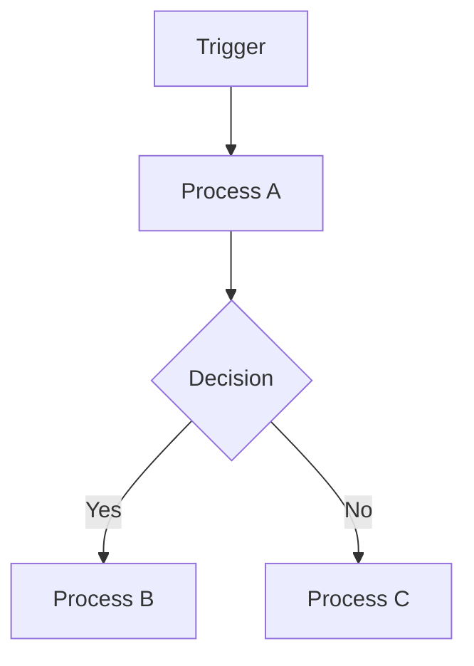

# PROCESS-MAP — {{project_name}}

> איך תהליכים זורמים. **auto-generated מ-`automations/` + n8n exports + automations-index.md**.

---

<!-- vault-process-map ימלא ממיפוי automations.
     לא לערוך בין markers — נכתב מחדש בכל refresh.
     הרץ: `vault refresh` (או ישיר: python3 04-OpenClaw/Skills/vault-process-map/run.py --project {{project_name}}) -->

<!-- AUTO-START: vault-process-map -->
_Auto-section לא הופעל עדיין. הרץ `vault refresh` למלא._
<!-- AUTO-END: vault-process-map -->

---

## ✏️ Manual — תרשים flow גדול
<!-- ASCII / mermaid. עוזר לראות את התמונה הגדולה.
     auto-section נותן רשימה — זה נותן יחסים. -->

---

## 🔗 Cross-workflow dependencies
<!-- איזה workflow מפעיל איזה. עוזר באיתור drift. -->
- 

## 📋 כללי priorities
<!-- אם 2 workflows יורים יחד — מה קורה? -->
- 
